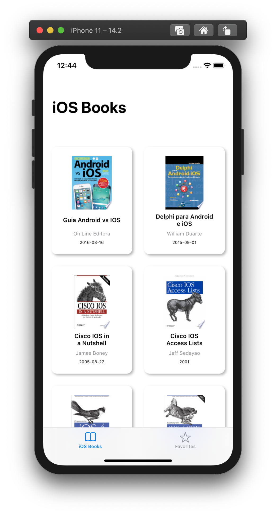
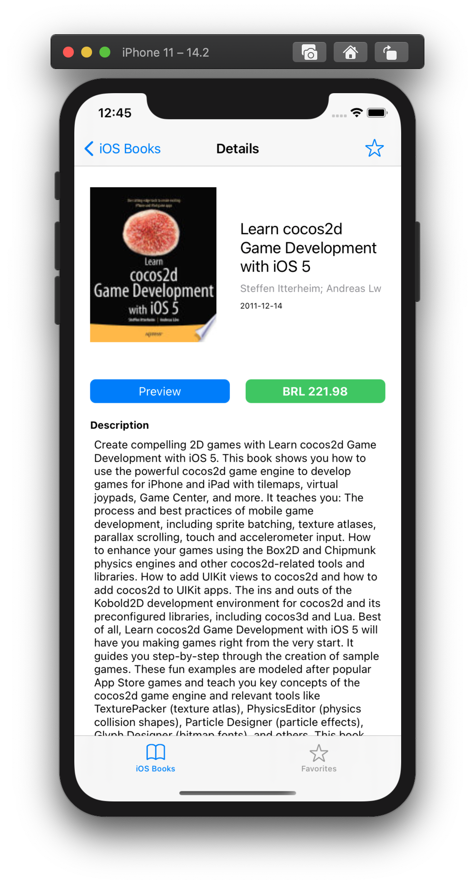
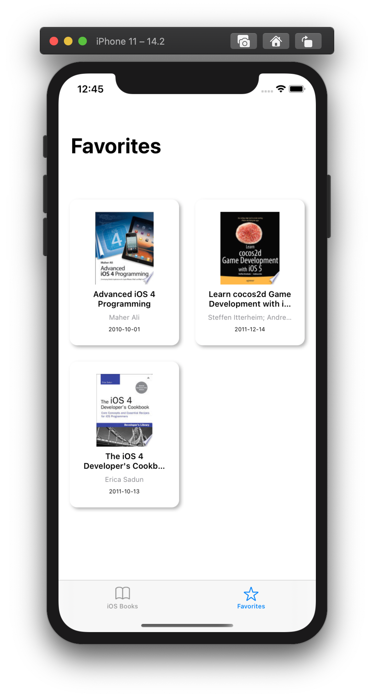

# Book Store App

 

- **Application language:** English
- **Code language:** English

___

**Portuguese version below 🇧🇷🇵🇹**

## About
This sample app was built as a test for the ITSector iOS engineer job.

The app consists of a book shop that lists books using the [Google Books API](https://developers.google.com/books). I built the app using [Swift](https://developer.apple.com/swift/) and the XCode's [Interface Builder](https://developer.apple.com/library/archive/documentation/ToolsLanguages/Conceptual/Xcode_Overview/UsingInterfaceBuilder.html#//apple_ref/doc/uid/TP40010215-CH42-SW1). Tha app respects the [MVVM Architecture](https://www.raywenderlich.com/34-design-patterns-by-tutorials-mvvm) patterns.




## Setup
First of all, clone this repo

```
git clone https://github.com/rodrigowoulddo/BookStore_Rodrigo
cd BookStore_Rodrigo
```

Then, install pods (using [CocoaPods](https://cocoapods.org/))
```
pod install
```

And finally, open the project and launch it on any device or simulator
```
xed .
```

## Main Features
- List of iOS Books using UICollectionView
- Details screen with book information
- Book preview and buy link
- Favorite / Unfavorite book
- Favorite books list
## Secondary Features
- iPad availability
- Infinite scroll, loading more books
- Auto update on favorites list
- URL access on Safari
- Auto-resizable content on book cells and details screen
- User Defaults object persistence for favorites
- Fully separated networking layer

## Other Information
For more app examples, check my GitHub page, specially the [Swift MVVM Example App](https://github.com/rodrigowoulddo/Swift-MVVM-Example-App) and my Objective-C version of the [MovieDB App](https://github.com/rodrigowoulddo/MovieDB-Objective-C).

___

**Versão em Português 🇧🇷🇵🇹**

## Sobre
Este exemplo de app foi desenvolvido como teste para a vaga de desenvolvedor iOS na ITSector.

O app consiste em uma loja de livros que utiliza a [API do Google Books](https://developers.google.com/books). O app foi desenvolvido utilizando [Swift](https://developer.apple.com/swift/) e o [Interface Builder](https://developer.apple.com/library/archive/documentation/ToolsLanguages/Conceptual/Xcode_Overview/UsingInterfaceBuilder.html#//apple_ref/doc/uid/TP40010215-CH42-SW1) do XCode. O app respeita os padrões da [Arquitetura MVVM](https://www.raywenderlich.com/34-design-patterns-by-tutorials-mvvm).

## Configuração
Primeiramente, clone o repositório

```
git clone https://github.com/rodrigowoulddo/BookStore_Rodrigo
cd BookStore_Rodrigo
```

Depois, instale os pods (utilizando [CocoaPods](https://cocoapods.org/))
```
pod install
```

E finalmente, abra o projeto e execute em qualquer aparelho ou simulador
```
xed .
```
## Principais Features
- Lista de Livros sobre iOS usando UICollectionView
- Página de detalhes com informações do livro
- Preview e link para compra do livro
- Favoritar / Desfavoritar livro
- Lista de livros favoritados

## Features Secundárias
- Disponibilidade para iPad
- Scroll infinito, carregando mais livros
- Acesso à URLs utilizando o Safari
- Conteúdo com tamanho automático nas cells e tela de detalhes
- Persistência de objetos utilizando User Defaults
- Camada de networking totalmente separada

## Outras Informações
Para mais exemplos, verifique minha página do GitHub, principalmente o [Swift MVVM Example App](https://github.com/rodrigowoulddo/Swift-MVVM-Example-App) e a minha implementação em Objective-C do [MovieDB App](https://github.com/rodrigowoulddo/MovieDB-Objective-C).
